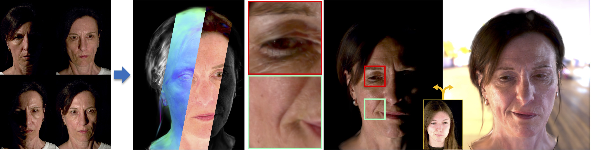

<div align="center">

# Becominglit: Relightable Gaussian Avatars with Hybrid Neural Shading

[Paper](https://arxiv.org/abs/2506.06271) | [Video](https://youtu.be/xPyeIqKdszA) | [Project Page](https://jonathsch.github.io/becominglit/) | [Dataset](https://github.com/jonathsch/becominglit-dataset)



</div>

BecomingLit reconstructs intrinsically decomposed head avatars based on 3D Gaussian primitives for real-time relighting and animation. In addition, we introduce a novel multi-view light stage dataset.

## Installation

The following will set up the project with PyTorch 2.5.1 CUDA 11.8. Other PyTorch/CUDA versions may also work but have not been tested.

```bash
# clone project
git clone https://github.com/jonathsch/becominglit
cd becominglit

# create conda environment
conda create -n becominglit python=3.11 -y
conda activate becominglit

# install CUDA toolkit
conda install -c "nvidia/label/cuda-11.8.0" cuda-toolkit cuda-runtime ninja -y
ln -s "$CONDA_PREFIX/lib" "$CONDA_PREFIX/lib64"
conda env config vars set CUDA_HOME=$CONDA_PREFIX

# (optional) set target architecures for CUDA compilations -> customize this based on your GPUs
conda env config vars set TORCH_CUDA_ARCH_LIST="7.5;8.0;8.6+PTX"
conda env config vars set TCNN_CUDA_ARCHITECTURES="75;80;86"

# re-activate environment to load env variables
conda deactivate
conda activate becominglit

# install PyTorch
pip install torch==2.5.1 torchvision==0.20.1 torchaudio==2.5.1 --index-url https://download.pytorch.org/whl/cu118

# install other requirements
pip install -r requirements.txt --no-build-isolation
```

## Environment variables
The project reads environment variables from `~/.config/becominglit/.env`. Please create this file and set the following variables to point to your desired locations:

```
BECOMINGLIT_DATASET_PATH=/path/to/becominglit-dataset # root path to the raw/working dataset
BECOMINGLIT_FLAME_TRACKING_PATH=/path/to/flame-tracking-results # path to FLAME tracking results (used by flame_tracker.py)
BECOMINGLIT_EXPERIMENT_PATH=/path/to/store/experiment/results # root path to store experiment results (trained models, logs, etc.)
```

## Dataset
We use the accompanying BecomingLit dataset for training and evaluation. Please refer to the [dataset repository](https://github.com/jonathsch/becominglit-dataset) for access and download.

Furher, you need to download the FLAME model (2023) from [FLAME model 2023](https://flame.is.tue.mpg.de/) and place the contents in `becominglit/assets/flame/`. At least the following files are required:
- `flame2023.pkl`
- `FLAME_masks.pkl`

**Important**: Before training, the dataset needs to be preprocessed. Please refer to [data preprocessing instructions](becominglit/data/preprocess/README.md).

## How to run

Train model with default configuration

```bash
python -m becominglit.scripts.run_train configs/default.yaml train.run_id="<<<YOUR_RUN_ID>>>"
```

You can override any parameter from command line like this

```bash
python -m becominglit.scripts.run_train configs/default.yaml dataloader.batch_size=8
```

## Inference

**Note**: All test results will be written to the respective run folder specified in the training config.

You can obtain test metrics and results by running
```bash
python -m becominglit.scripts.run_test PATH/TO/RUN/FOLDER/config.yaml
```

With the following command you can visualize point-light and env-light spinning renderings
```bash
python -m becominglit.scripts.run_relight PATH/TO/RUN/FOLDER/config.yaml envmap_path=PATH/TO/ENVMAP/file.hdr
```

### Cross-reenactment

Drive the trained avatar's appearance with another subject's expressions and poses:
```bash
python -m becominglit.scripts.run_reenact PATH/TO/RUN/FOLDER/config.yaml driver_subject=XXXX driver_sequence=SEQ_NAME
```

### Animation with arbitrary FLAME parameters

Animate the avatar with FLAME parameters from an external NPZ file. The NPZ should contain per-frame arrays: `expr` `[T, 100]`, `rotation` `[T, 3]`, `neck_pose` `[T, 3]`, `jaw_pose` `[T, 3]`, `eyes_pose` `[T, 6]`, `translation` `[T, 3]`. Identity parameters (shape, static offset) are taken from the trained model's subject.

```bash
python -m becominglit.scripts.run_animate PATH/TO/RUN/FOLDER/config.yaml flame_params_path=PATH/TO/PARAMS.npz
```

## Acknowledgements

- Some of the utility functions (see note in the respective source files) and code structure is borrowed from the [Goliath](https://github.com/facebookresearch/goliath) codebase, which is licensed under the CC-BY-NC 4.0 License.

- The environment map processing and shading logic is inspired by [nvdiffrec](https://github.com/NVlabs/nvdiffrec).

- The FLAME tracker is based on [VHAP](https://github.com/ShenhanQian/VHAP)

We thank all above authors for open-sourcing their great work.

## Citation
If you find this work useful in your research, please consider citing:

```bibtex
@inproceedings{
  schmidt2025becominglit,
  title={BecomingLit: Relightable Gaussian Avatars with Hybrid Neural Shading},
  author={Jonathan Schmidt and Simon Giebenhain and Matthias Niessner},
  booktitle={The Thirty-ninth Annual Conference on Neural Information Processing Systems},
  year={2025},
}
```
